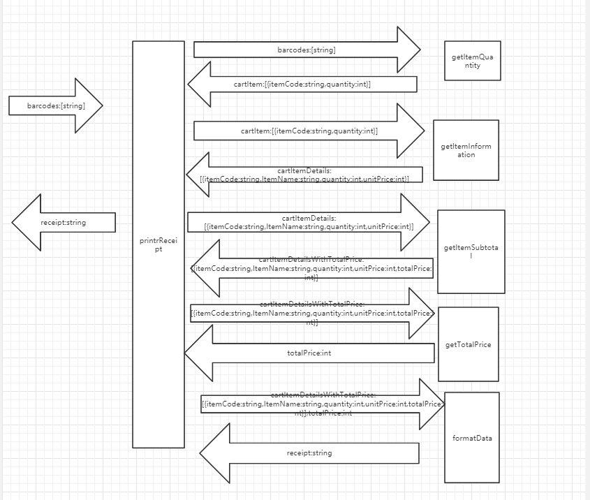

# 任务分解列表
## 1.统计每个item的数量
输入：string数组

输出：对象数组
## 2.完善item的信息
输入：对象数组

输出：对象数组
## 3.计算每种item的总价
输入：对象数组

输出：对象数组
## 4.计算所有商品总价
输入：对象数组

输出：int值
## 5.得到格式化输出
输入：对象数组，int值

输出：string

# 上下文图

#PDCA
## plan：
计划一个小时做完任务
## do：
实际上做完到最后花了两个半小时左右
## check：
我反思我花了比预期翻倍的时间，觉得还是我对js语法不够熟悉，对对象数组的使用不够熟悉，以及画图花了过长时间
## action：
我打算周末的时候再多多练习一下有关js的对象数组转换题目，增加对js的熟悉程度
